# Python Workshop 🐍
## From Fundamentals to Mastery

<div class="flex items-center justify-center gap-8 mt-8 mb-6">
  <!-- Profile Card -->
  <div class="flex flex-col items-center bg-white/10 backdrop-blur-lg rounded-2xl p-6 border border-white/20 shadow-xl">
    
    <h3 class="text-xl font-bold text-white mb-1">Tauqeer Ahmad</h3>
    <div class="bg-blue-500/80 px-3 py-1 rounded-full mb-1">
      <span class="text-white text-sm font-medium">Developer Operations Engineer</span>
    </div>
    <p class="text-white/80 text-sm">Managing Production & Observability at NCR Atleos</p>
  </div>
  
  <!-- Portfolio QR Code -->
  <div class="flex flex-col items-center bg-white/10 backdrop-blur-lg rounded-2xl p-4 border border-white/20 shadow-xl">
    
    <p class="text-white text-sm font-medium text-center">Scan for Portfolio</p>
    <p class="text-white/70 text-xs">Connect with me!</p>
  </div>
</div>

---
layout: default
---

# Why Python? 🤔

<div grid="~ cols-2 gap-12">
<div>

## 🚀 **Beginner Friendly**
- Clean, readable syntax
- No complex syntax rules
- Interactive learning environment

## � **Powerful & Versatile**
- Web development (Django, Flask)
- Data science (Pandas, NumPy)
- AI/ML (TensorFlow, PyTorch)
- Automation & scripting

</div>
<div>

## 🌍 **Popular & In-Demand**
- #1 programming language (2024)
- High job market demand
- Massive community support

## 📈 **Great for Career Growth**
- High average salaries
- Multiple career paths
- Future-proof technology

<div class="mt-8 p-4 bg-blue-50 rounded-lg dark:bg-blue-900">
💡 <strong>Fun Fact:</strong> Python is named after Monty Python's Flying Circus!
</div>

</div>
</div>

<!--
Python's popularity isn't just hype - it's backed by real advantages. Its simplicity makes it perfect for beginners, while its power makes it suitable for complex applications.
-->

---
layout: two-cols
layoutClass: gap-16
---

# Workshop Agenda 📋

<div class="text-sm">

## **Part 1: Python Foundations** 🏗️
- **Python Syntax Overview**
  - Variables, operators, basic I/O
- **Data Types Deep Dive**
  - Lists, dictionaries, sets, tuples

## **Part 2: Control & Flow** ⚡
- **Conditional Logic**
  - If statements, comparisons
- **Loops & Iteration**
  - For loops, while loops, control

## **Part 3: Robust Code** 🛡️
- **Exception Handling**
  - Try-except, error management
- **Best Practices**
  - Clean code, debugging tips

</div>

::right::

<div class="pl-4">

## **Learning Approach** 🎯

```mermaid {scale: 0.8}
graph TD
    A[👀 See Example] --> B[💻 Try Code]
    B --> C[🔄 Modify & Experiment]
    C --> D[🎯 Practice Exercises]
    D --> E[🏆 Master Concept]
    E --> F[➡️ Next Topic]
```



<div class="mt-6 p-4 bg-green-50 rounded-lg dark:bg-green-900">
<strong>💡 Pro Tip:</strong> Don't just watch - code along! The best way to learn programming is by doing.
</div>

</div>

<!--
Our agenda is designed progressively - each section builds on the previous one. We'll start with fundamentals and work our way up to more advanced concepts.
-->

---
layout: section
class: text-center
---

# Part 1: Python Syntax Overview 🐍
## Let's Start with the Basics

<!--
Now we dive into the core of Python - its syntax. This is where you'll learn the building blocks that everything else is built upon.
-->

---
layout: two-cols
layoutClass: gap-12
---

# Variables & Data Types 📦

Python is **dynamically typed** - no need to declare variable types!

```python {monaco}
# Numbers
age = 25
height = 5.9
pi = 3.14159

# Strings
name = "Alice"
message = 'Hello, World!'
multiline = """This is a
multi-line string"""

# Booleans
is_student = True
is_working = False

# None type
data = None
```

::right::

<div v-click>

## Variable Naming Rules 📝

✅ **Good Examples:**
```python
user_name = "John"
total_score = 100
MAX_ATTEMPTS = 3
is_valid = True
```

❌ **Avoid These:**
```python
2names = "Invalid"    # Can't start with number
user-name = "Invalid" # No hyphens
class = "Invalid"     # Reserved keyword
```

<div class="mt-4 p-3 bg-yellow-50 rounded dark:bg-yellow-900">
<strong>💡 Convention:</strong> Use snake_case for variables and functions, UPPER_CASE for constants.
</div>

</div>

<!--
Python's dynamic typing is both a strength and requires careful attention. Variables can change types, but good naming conventions help maintain clarity.
-->

---
layout: default
---

# String Formatting & Output 📝

<div grid="~ cols-2 gap-8">
<div>

## **F-Strings (Recommended!)** ⭐
```python {monaco}
name = "Python"
version = 3.12
year = 2024

# Modern f-string formatting
message = f"Welcome to {name} {version}!"
print(message)

# With expressions
print(f"Next year: {year + 1}")

# With formatting
pi = 3.14159
print(f"Pi: {pi:.2f}")  # 2 decimal places
```

</div>
<div>

## **Other Formatting Methods**
```python
# .format() method
template = "Hello, {}! Today is {}"
print(template.format("Alice", "Monday"))

# % formatting (older style)
print("Name: %s, Age: %d" % ("Bob", 30))

# Multiple print arguments
print("Value 1:", 42, "Value 2:", "text")
```

<div v-click class="mt-4 p-3 bg-blue-50 rounded dark:bg-blue-900">
<strong>🎯 Best Practice:</strong> Use f-strings for readability and performance!
</div>

</div>
</div>

<!--
String formatting is crucial for creating dynamic output. F-strings are the modern, preferred approach due to their readability and performance.
-->

---
layout: default
---

# Operators Deep Dive ⚡

<div grid="~ cols-3 gap-6">
<div>

## **Arithmetic** 🧮
```python {monaco}
a, b = 10, 3

print(f"{a} + {b} = {a + b}")    # 13
print(f"{a} - {b} = {a - b}")    # 7
print(f"{a} * {b} = {a * b}")    # 30
print(f"{a} / {b} = {a / b}")    # 3.333...
print(f"{a} // {b} = {a // b}")  # 3 (floor)
print(f"{a} % {b} = {a % b}")    # 1 (remainder)
print(f"{a} ** {b} = {a ** b}")  # 1000 (power)
```

</div>
<div>

## **Comparison** 🔍
```python
x, y = 5, 10

print(f"{x} == {y}: {x == y}")   # False
print(f"{x} != {y}: {x != y}")   # True
print(f"{x} < {y}: {x < y}")     # True
print(f"{x} > {y}: {x > y}")     # False
print(f"{x} <= {y}: {x <= y}")   # True
print(f"{x} >= {y}: {x >= y}")   # False

# String comparison
print("'apple' < 'banana':", 'apple' < 'banana')  # True
```

</div>
<div>

## **Logical** 🧠
```python
is_sunny = True
is_warm = False

print(f"Sunny AND Warm: {is_sunny and is_warm}")
print(f"Sunny OR Warm: {is_sunny or is_warm}")
print(f"NOT Sunny: {not is_sunny}")

# Short-circuit evaluation
result = True or print("This won't execute")
```

<div v-click class="mt-4 p-2 bg-green-50 rounded text-sm dark:bg-green-900">
💡 <strong>Tip:</strong> Use parentheses for complex logical expressions!
</div>

</div>
</div>

<!--
Understanding operators is fundamental. Notice Python's floor division (//) and exponentiation (**) operators, which are unique features.
-->

---
layout: section
class: text-center
---

# Part 2: Data Structures 📊
## Lists, Dictionaries, Sets & Tuples

<!--
Data structures are the containers that hold your data. Choosing the right one can make your code more efficient and readable.
-->

---
layout: two-cols
layoutClass: gap-12
---

# Lists - Your Dynamic Arrays 📋

<div class="text-sm">

## **Creating & Accessing**
```python {monaco}
# Creating lists
fruits = ["apple", "banana", "cherry"]
numbers = [1, 2, 3, 4, 5]
mixed = [1, "hello", 3.14, True]

# Accessing elements
print(fruits[0])      # "apple" (first)
print(fruits[-1])     # "cherry" (last)
print(numbers[1:4])   # [2, 3, 4] (slice)
```

## **List Methods**
```python
fruits.append("date")        # Add to end
fruits.insert(1, "orange")   # Insert at index
fruits.remove("banana")      # Remove by value
last_fruit = fruits.pop()    # Remove & return last
```

</div>

::right::

<div class="text-sm">

## **List Comprehensions** ✨
```python {monaco}
# Traditional way
squares = []
for x in range(10):
    squares.append(x ** 2)

# List comprehension (Pythonic!)
squares = [x ** 2 for x in range(10)]

# With conditions
even_squares = [x ** 2 for x in range(10) if x % 2 == 0]

# Nested lists
matrix = [[i*j for j in range(3)] for i in range(3)]
```

<div v-click class="mt-4 p-3 bg-purple-50 rounded dark:bg-purple-900">
<strong>🚀 Pro Tip:</strong> List comprehensions are faster and more Pythonic than traditional loops!
</div>

</div>

<!--
Lists are ordered, mutable collections. They're perfect when you need to maintain order and frequently add/remove elements.
-->

---
layout: two-cols
layoutClass: gap-12
---

# Dictionaries - Key-Value Power 🗂️

<div class="text-sm">

## **Creating & Accessing**
```python {monaco}
# Creating dictionaries
student = {
    "name": "Alice",
    "age": 20,
    "major": "Computer Science",
    "gpa": 3.8
}

# Accessing values
print(student["name"])        # "Alice"
print(student.get("age"))     # 20
print(student.get("phone", "Not found"))  # Safe access

# Adding/updating
student["phone"] = "123-456-7890"
student.update({"year": 2024, "semester": "Fall"})
```

</div>

::right::

<div class="text-sm">

## **Dictionary Methods & Patterns**
```python {monaco}
# Useful methods
keys = student.keys()      # dict_keys(['name', 'age', ...])
values = student.values()  # dict_values(['Alice', 20, ...])
items = student.items()    # key-value pairs

# Dictionary comprehension
squares = {x: x**2 for x in range(5)}
# {0: 0, 1: 1, 2: 4, 3: 9, 4: 16}

# Nested dictionaries
gradebook = {
    "Alice": {"math": 95, "science": 88},
    "Bob": {"math": 87, "science": 92}
}
```

<div v-click class="mt-4 p-3 bg-blue-50 rounded dark:bg-blue-900">
<strong>⚡ When to use:</strong> Fast lookups, relationships, JSON-like data
</div>

</div>

<!--
Dictionaries provide O(1) average case lookup time. They're perfect for mapping relationships and when you need fast access by key.
-->

---
layout: two-cols
layoutClass: gap-12
---

# Sets & Tuples - Special Collections 🎯

<div class="text-sm">

## **Sets - Unique Elements Only**
```python {monaco}
# Creating sets
colors = {"red", "green", "blue"}
numbers = set([1, 2, 2, 3, 3, 4])  # {1, 2, 3, 4}

# Set operations
set1 = {1, 2, 3, 4}
set2 = {3, 4, 5, 6}

union = set1 | set2         # {1, 2, 3, 4, 5, 6}
intersection = set1 & set2  # {3, 4}
difference = set1 - set2    # {1, 2}

# Membership testing (very fast!)
print(3 in set1)  # True
```

<div v-click class="mt-3 p-2 bg-orange-50 rounded text-xs dark:bg-orange-900">
💡 <strong>Use sets for:</strong> Removing duplicates, fast membership testing, mathematical operations
</div>

</div>

::right::

<div class="text-sm">

## **Tuples - Immutable Sequences**
```python {monaco}
# Creating tuples
point = (3, 4)
colors = ("red", "green", "blue")
single = (42,)  # Note the comma!

# Tuple unpacking
x, y = point  # x=3, y=4
first, *rest, last = (1, 2, 3, 4, 5)
# first=1, rest=[2, 3, 4], last=5

# Named tuples
from collections import namedtuple
Person = namedtuple('Person', ['name', 'age'])
alice = Person('Alice', 25)
print(alice.name)  # "Alice"
```

<div v-click class="mt-3 p-2 bg-green-50 rounded text-xs dark:bg-green-900">
💡 <strong>Use tuples for:</strong> Coordinates, fixed data, dictionary keys, multiple return values
</div>

</div>

<!--
Sets guarantee uniqueness and provide fast operations. Tuples are immutable and perfect for fixed collections or when you need hashable sequences.
-->

---
layout: section
class: text-center
---

# Part 3: Control Flow ⚡
## Making Decisions and Repeating Actions

<!--
Control flow is what makes programs dynamic and responsive. It's how we teach computers to make decisions and repeat actions.
-->

---
layout: two-cols
layoutClass: gap-12
---

# Conditional Logic - If Statements 🤔

<div class="text-sm">

## **Basic If-Elif-Else**
```python {monaco}
age = 18
income = 30000

if age >= 18:
    print("You can vote!")
elif age >= 16:
    print("You can drive!")
else:
    print("You're still young!")

# Multiple conditions
if age >= 18 and income > 25000:
    print("Eligible for loan")
elif age >= 21 or income > 50000:
    print("Special consideration")
else:
    print("Not eligible")
```

</div>

::right::

<div class="text-sm">

## **Advanced Patterns**
```python {monaco}
# Ternary operator (conditional expression)
status = "adult" if age >= 18 else "minor"

# Membership testing
valid_grades = ['A', 'B', 'C', 'D', 'F']
grade = 'B'
if grade in valid_grades:
    print(f"Grade {grade} is valid")

# Checking for None
user_input = None
if user_input is not None:
    print(f"Processing: {user_input}")

# Chaining comparisons
score = 85
if 80 <= score <= 90:
    print("Grade: B")
```

<div v-click class="mt-4 p-3 bg-blue-50 rounded dark:bg-blue-900">
<strong>🎯 Best Practice:</strong> Use 'is' for None, 'in' for membership, chain comparisons naturally
</div>

</div>

<!--
Python's conditional logic is very readable. Notice the use of 'is' vs '==' and the ability to chain comparisons naturally.
-->

---
layout: two-cols
layoutClass: gap-12
---

# For Loops - Iterating with Style 🔄

<div class="text-sm">

## **Basic For Loops**
```python {monaco}
# Iterating over lists
fruits = ["apple", "banana", "cherry"]
for fruit in fruits:
    print(f"I love {fruit}")

# Range function
for i in range(5):        # 0, 1, 2, 3, 4
    print(i)

for i in range(2, 8, 2):  # 2, 4, 6 (start, stop, step)
    print(i)

# Iterating over strings
for char in "Python":
    print(char)
```

</div>

::right::

<div class="text-sm">

## **Advanced For Loop Patterns**
```python {monaco}
# Enumerate - get index and value
fruits = ["apple", "banana", "cherry"]
for index, fruit in enumerate(fruits):
    print(f"{index}: {fruit}")

# Zip - iterate multiple sequences
names = ["Alice", "Bob", "Charlie"]
ages = [25, 30, 35]
for name, age in zip(names, ages):
    print(f"{name} is {age} years old")

# Loop control
for i in range(10):
    if i == 3:
        continue  # Skip this iteration
    if i == 7:
        break     # Exit the loop
    print(i)
else:
    print("Loop completed normally")  # Only runs if no break
```

<div v-click class="mt-4 p-3 bg-purple-50 rounded dark:bg-purple-900">
<strong>🚀 Pro Tip:</strong> Use enumerate() instead of range(len()), and zip() for parallel iteration!
</div>

</div>

<!--
Python's for loops are incredibly versatile. The enumerate and zip functions are particularly Pythonic ways to handle common iteration patterns.
-->

---
layout: two-cols
layoutClass: gap-12
---

# While Loops & Input Validation 🔁

<div class="text-sm">

## **Basic While Loops**
```python {monaco}
# Countdown example
count = 5
while count > 0:
    print(f"Countdown: {count}")
    count -= 1
print("Blast off! 🚀")

# Processing until condition
total = 0
numbers = [1, 2, 3, 4, 5]
i = 0
while i < len(numbers) and total < 10:
    total += numbers[i]
    i += 1
print(f"Total: {total}")
```

</div>

::right::

<div class="text-sm">

## **Input Validation Pattern**
```python {monaco}
# Getting valid input
while True:
    try:
        age = int(input("Enter your age: "))
        if 0 <= age <= 120:
            break
        else:
            print("Please enter age between 0-120")
    except ValueError:
        print("Please enter a valid number")

print(f"Your age is {age}")

# Menu system
while True:
    choice = input("Choose (1) Start, (2) Settings, (3) Quit: ")
    if choice == "1":
        print("Starting game...")
    elif choice == "2":
        print("Opening settings...")
    elif choice == "3":
        print("Goodbye!")
        break
    else:
        print("Invalid choice. Try again.")
```

<div v-click class="mt-4 p-3 bg-yellow-50 rounded dark:bg-yellow-900">
<strong>⚠️ Warning:</strong> Always ensure your while loop has an exit condition to avoid infinite loops!
</div>

</div>

<!--
While loops are perfect for input validation and when you don't know exactly how many iterations you need. Always be careful to avoid infinite loops.
-->

---
layout: section
class: text-center
---

# Part 4: Exception Handling 🛡️
## Building Robust, Error-Resistant Code

<!--
Exception handling is what separates amateur code from professional code. It's about anticipating what can go wrong and handling it gracefully.
-->

---
layout: two-cols
layoutClass: gap-12
---

# Try-Except Blocks - Your Safety Net 🎯

<div class="text-sm">

## **Basic Exception Handling**
```python {monaco}
# Basic try-except
try:
    number = int(input("Enter a number: "))
    result = 10 / number
    print(f"Result: {result}")
except ValueError:
    print("That's not a valid number!")
except ZeroDivisionError:
    print("Cannot divide by zero!")

# Catching multiple exceptions
try:
    # Some risky operation
    data = eval(user_input)  # Never do this in real code!
except (ValueError, SyntaxError, NameError):
    print("Invalid input")
```

</div>

::right::

<div class="text-sm">

## **Advanced Exception Handling**
```python {monaco}
# Complete try-except-else-finally
try:
    file = open("data.txt", "r")
    data = file.read()
    processed = process_data(data)
except FileNotFoundError:
    print("File not found!")
    processed = []
except PermissionError:
    print("Permission denied!")
    processed = []
else:
    print("File processed successfully!")  # Only if no exception
finally:
    try:
        file.close()  # Always runs
    except NameError:
        pass  # File was never opened

# Getting exception details
try:
    risky_operation()
except Exception as e:
    print(f"Error occurred: {e}")
    print(f"Error type: {type(e).__name__}")
```

<div v-click class="mt-4 p-3 bg-red-50 rounded dark:bg-red-900">
<strong>🚨 Best Practice:</strong> Catch specific exceptions, not just Exception!
</div>

</div>

<!--
Exception handling isn't just about preventing crashes - it's about providing meaningful feedback and graceful degradation when things go wrong.
-->

---
layout: default
---

# Real-World Exception Patterns 🌍

<div grid="~ cols-2 gap-8">
<div>

## **File Operations**
```python {monaco}
# Safe file reading
def read_config(filename):
    try:
        with open(filename, 'r') as file:
            return json.load(file)
    except FileNotFoundError:
        print(f"Config file {filename} not found")
        return {}
    except json.JSONDecodeError:
        print(f"Invalid JSON in {filename}")
        return {}
    except PermissionError:
        print(f"Permission denied: {filename}")
        return {}

# Using context managers (with statement)
try:
    with open("data.txt", "w") as file:
        file.write("Important data")
        # File automatically closed, even if error occurs
except IOError as e:
    print(f"File operation failed: {e}")
```

</div>
<div>

## **API & Network Operations**
```python {monaco}
import requests

def fetch_user_data(user_id):
    try:
        response = requests.get(
            f"https://api.example.com/users/{user_id}",
            timeout=5
        )
        response.raise_for_status()  # Raises exception for bad status
        return response.json()
    except requests.exceptions.Timeout:
        print("Request timed out")
        return None
    except requests.exceptions.ConnectionError:
        print("Connection failed")
        return None
    except requests.exceptions.HTTPError as e:
        print(f"HTTP error: {e}")
        return None
    except ValueError:  # JSON decode error
        print("Invalid response format")
        return None
```

<div v-click class="mt-4 p-3 bg-green-50 rounded dark:bg-green-900">
<strong>💡 Pro Tip:</strong> Use context managers (with statements) for resource management!
</div>

</div>
</div>

<!--
Real applications need robust error handling. File operations and API calls are common sources of errors that need careful handling.
-->

---
layout: section
class: text-center
---

# Part 5: Best Practices & Next Steps 🚀
## Writing Clean, Pythonic Code

<!--
Now that you know the fundamentals, let's talk about writing code that other developers (and future you) will love.
-->

---
layout: two-cols
layoutClass: gap-12
---

# Python Best Practices ✨

<div class="text-sm">

## **Code Style (PEP 8)**
```python {monaco}
# Good: Clear, readable names
def calculate_monthly_payment(principal, rate, years):
    monthly_rate = rate / 12
    num_payments = years * 12
    return principal * (monthly_rate * (1 + monthly_rate) ** num_payments) / \
           ((1 + monthly_rate) ** num_payments - 1)

# Good: List comprehensions for simple cases
even_squares = [x**2 for x in range(10) if x % 2 == 0]

# Good: Use of context managers
with open('data.txt', 'r') as file:
    content = file.read()

# Good: Clear error handling
try:
    result = risky_operation()
except SpecificError as e:
    logger.error(f"Operation failed: {e}")
    result = default_value
```

</div>

::right::

<div class="text-sm">

## **Common Pitfalls to Avoid**
```python
# Bad: Mutable default arguments
def bad_function(items=[]):  # DON'T DO THIS!
    items.append(1)
    return items

# Good: Use None as default
def good_function(items=None):
    if items is None:
        items = []
    items.append(1)
    return items

# Bad: Comparing to True/False
if is_valid == True:  # DON'T DO THIS!
    pass

# Good: Direct boolean evaluation
if is_valid:
    pass

# Bad: Bare except clauses
try:
    risky_code()
except:  # DON'T DO THIS!
    pass

# Good: Specific exception handling
try:
    risky_code()
except ValueError as e:
    handle_error(e)
```

<div v-click class="mt-4 p-3 bg-purple-50 rounded dark:bg-purple-900">
<strong>📖 Remember:</strong> Code is read more often than it's written!
</div>

</div>

<!--
These best practices aren't just style choices - they prevent bugs, improve readability, and make your code more maintainable.
-->

---
layout: default
---

# Quick Practice Challenge 🏃‍♂️

Let's put it all together! Try to solve this step by step:

<div grid="~ cols-2 gap-8">
<div>

## **The Challenge**
Create a program that:
1. 📝 Asks user for their favorite programming languages
2. 📊 Stores them in a list
3. 🔍 Removes duplicates using a set
4. 📈 Counts how many languages they know
5. 🎯 Handles invalid input gracefully

<div class="mt-4 p-3 bg-blue-50 rounded dark:bg-blue-900">
<strong>🎯 Goal:</strong> Use lists, sets, loops, and exception handling!
</div>

</div>
<div>

## **Solution Template**
```python {monaco}
def collect_languages():
    languages = []
    
    print("Enter your favorite programming languages:")
    print("(Type 'done' when finished)")
    
    while True:
        try:
            language = input("Language: ").strip()
            
            if language.lower() == 'done':
                break
            elif language:  # Not empty
                languages.append(language.title())
            else:
                print("Please enter a valid language name")
                
        except KeyboardInterrupt:
            print("\nOperation cancelled")
            break
    
    # Remove duplicates and sort
    unique_languages = sorted(set(languages))
    
    print(f"\nYou know {len(unique_languages)} languages:")
    for i, lang in enumerate(unique_languages, 1):
        print(f"{i}. {lang}")

# collect_languages()  # Uncomment to run
```

</div>
</div>

<!--
This challenge incorporates everything we've learned: user input, lists, sets, loops, exception handling, and string methods.
-->

---
layout: section
class: text-center
---

# What's Next? 🌟
## Your Python Journey Continues

<!--
This is just the beginning! Python has so much more to offer, and you now have the foundation to explore it all.
-->

---
layout: two-cols
layoutClass: gap-12
---

# Continue Your Learning Path 📚

<div class="text-sm">

## **Immediate Next Steps**
- 🔧 **Functions & Modules**
  - Creating reusable code
  - Importing and organizing code
- 📦 **Object-Oriented Programming**
  - Classes, objects, inheritance
  - Design patterns
- 🏗️ **File I/O & Data Processing**
  - Working with CSV, JSON
  - Data manipulation with Pandas

## **Intermediate Topics**
- 🌐 **Web Development**
  - Flask or Django frameworks
  - REST APIs and databases
- 📊 **Data Science**
  - NumPy, Pandas, Matplotlib
  - Machine learning with scikit-learn

</div>

::right::

<div class="text-sm">

## **Resources to Explore**
- 📖 **Official Python Tutorial**: python.org/tutorial
- 💻 **Practice Platforms**:
  - LeetCode, HackerRank, Codewars
  - Python.org's practice problems
- 📚 **Books**:
  - "Automate the Boring Stuff with Python"
  - "Python Crash Course"
  - "Effective Python" by Brett Slatkin

## **Join the Community**
- 🐍 **Reddit**: r/learnpython, r/Python
- 💬 **Discord**: Python Discord server
- 🏢 **Local Meetups**: Python user groups
- 📺 **YouTube**: Real Python, Corey Schafer

<div class="mt-4 p-3 bg-green-50 rounded dark:bg-green-900">
<strong>🎯 Remember:</strong> The best way to learn programming is by building projects!
</div>

</div>

<!--
The Python ecosystem is vast and welcoming. Don't try to learn everything at once - pick one area that interests you and dive deep.
-->

---
layout: center
class: text-center
---

# Congratulations! 🎉

## You've Completed the Python Fundamentals Workshop

<div class="flex items-center justify-center space-x-8 mt-12">
  <div class="text-center">
    <div class="text-4xl mb-2">✅</div>
    <div class="text-sm">Python Syntax</div>
  </div>
  <div class="text-center">
    <div class="text-4xl mb-2">📊</div>
    <div class="text-sm">Data Structures</div>
  </div>
  <div class="text-center">
    <div class="text-4xl mb-2">⚡</div>
    <div class="text-sm">Control Flow</div>
  </div>
  <div class="text-center">
    <div class="text-4xl mb-2">🛡️</div>
    <div class="text-sm">Exception Handling</div>
  </div>
</div>

<div class="mt-12 space-y-4">
  <div class="text-xl">🐍 You're now ready to tackle real Python projects!</div>
  <div class="text-lg opacity-75">Keep coding, keep learning, keep building amazing things.</div>
</div>

<div class="absolute bottom-6 left-6 text-sm opacity-50">
  Python Workshop • July 3rd, 2024 • Tauqeer Ahmad
</div>

<div class="absolute bottom-6 right-6 text-sm opacity-50">
  <a href="https://python.org" target="_blank" class="hover:opacity-100">
    🐍 python.org
  </a>
</div>

<!--
You've covered a lot of ground today! Take time to practice these concepts by building small projects. Remember, every expert was once a beginner.
-->
